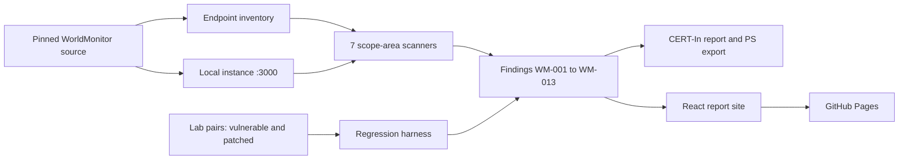

# SIH26163: SEAM, an Advisory-Aware Security Assessment of WorldMonitor

> Smart India Hackathon 2026 | PS ID: **26163** | Organisation: **NTRO** | Category: **Software**

SEAM is an evidence-first security assessment platform for the WorldMonitor application (`github.com/koala73/worldmonitor`, AGPL-3.0). It fetches the real source at a pinned commit, runs the real app on `localhost`, scans all seven scope areas of the problem statement, scores every verdict in code (CVSS 3.1, CVSS 4.0, EPSS), reproduces published advisory classes in lab pairs, and publishes the whole result as a live report. Nothing in the report is typed by hand: it is regenerated from the findings on every push.

## Problem Statement

Security reviews of a large, fast-moving codebase are usually slide-driven: a list of claims with no way to check them. NTRO needs an assessment of the World Monitor application that a reviewer can re-run, inspect and challenge, that separates what was reproduced from what was verified secure and what is only a candidate, and that reports controls that held as clearly as bugs that did not.

## Proposed Solution

- **Live report:** [https://arushjain-697.github.io/SIH-2026/](https://arushjain-697.github.io/SIH-2026/)
- **Source:** [https://github.com/ArushJain-697/SIH-2026](https://github.com/ArushJain-697/SIH-2026)

The engine is plain Node (18+, zero external dependencies, plus an isolated TypeScript-AST sub-package). A GitHub Actions workflow runs the whole pipeline: pin the source, start the real target on `localhost:3000`, run the scanners, reproduce advisory classes, regenerate the CERT-In report and the PS-format export, then publish a React report site to GitHub Pages. WorldMonitor's own 11 published advisories are used as prior art: the harness reproduces two of them to prove the method, and never claims them as discoveries.

## Key Features

- Seven scanners, one per PS scope area, including a TypeScript-AST pass over 791 real source files
- Independent re-derivation of the target's own CI guardrails (rate-limit coverage across 236 gateway routes, CORS across 24 files, 262 type-cast sites)
- Every finding carries an explicit status: `REPRODUCED-KNOWN`, `CONFIRMED-NOVEL`, `CANDIDATE-UNCONFIRMED` or `VERIFIED-SECURE`
- CVSS 3.1 and 4.0 calculators written in the engine; the 4.0 one matches FIRST's reference implementation on 2000 of 2000 random vectors
- EPSS lookup against the public FIRST API, with an honest "not applicable" when a finding has no CVE
- Advisory-aware regression harness: vulnerable and patched lab pairs, re-run on every build
- Two remediation patches as real diffs, verified with `git apply --check` or `git diff --no-index`
- CycloneDX SBOM, CERT-In-format report and a PS-schema export, all generated
- Safety enforced in code: the probe throws on any host outside `localhost`, `127.0.0.1` and `::1`

## Results

| Metric | Value |
| --- | --- |
| Scope areas with direct evidence | 7 of 7 |
| Findings | 13 (2 reproduced-known, 10 verified-secure, 1 candidate-unconfirmed, 0 confirmed-novel) |
| Endpoints inventoried | 365 (236 gateway routes) |
| Prior advisories mapped | 12 (11 published, 1 draft) |
| Regression suite | 2 of 2 pass |
| CVSS 4.0 calculator vs FIRST reference | 2000 of 2000 match |
| Verified remediation patches | 2 |

No novel finding was produced, and the report says so. The two areas investigated most deeply both held under independent verification.

## Technology Stack

| Layer | Technologies |
| --- | --- |
| Engine and scanners | Node.js 18+ (ESM), zero external dependencies |
| AST analysis | TypeScript Compiler API in an isolated sub-package (`engine/scanners/ast-tools`) |
| Scoring | In-repo CVSS 3.1 and 4.0 calculators, FIRST EPSS API client |
| Report site | React 18, TypeScript, Vite, `motion`, `lucide-react` |
| CI and hosting | GitHub Actions, GitHub Pages |
| Target under test | WorldMonitor built from source on `localhost:3000` (Vite dev server) |

## Architecture



Every dynamic request passes through `engine/probe/safe-http.mjs`, which refuses any host outside the local lab.

## Repository Structure

```text
SIH-2026/
├── README.md
├── package.json                  # all npm scripts
├── engine/                       # inventory, scanners, CVSS/EPSS scoring, probe, report builders
│   ├── probe/safe-http.mjs       # the only way any scanner touches the network
│   ├── scanners/                 # one scanner per PS scope area, plus SCA and secrets
│   └── report/                   # PS export and report-site data builder
├── framework/                    # seam-linter, regression harness, schema, report generators
├── findings/                     # WM-001 to WM-013: finding.md, evidence/, reproduce.sh
├── lab/                          # target fetch script, mock upstream, vulnerable/patched lab pairs
├── register/advisories.json      # prior-art register (11 published, 1 draft)
├── report/                       # generated CERT-In report and PS export
├── report-app/                   # React report site (landing page and console)
├── docs/                         # ROE, ground truth, coverage matrix, proof spine, build maps
├── tests/                        # unit, safety, schema and landmine tests
└── .github/workflows/assess.yml  # full pipeline and Pages deploy
```

## Installation and Run

Requires Node.js 18+ (the CI uses 24). The engine has no dependencies to install.

```bash
git clone https://github.com/ArushJain-697/SIH-2026.git
cd SIH-2026
npm test
```

Open the report site locally:

```bash
npm --prefix report-app install
npm start
```

### Run the assessment against the real target

```bash
npm run fetch-target        # shallow-clone WorldMonitor at the pinned commit (read-only)
npm run instance:install    # install the target's dependencies
npm run instance:up         # start it on localhost:3000 (separate terminal)
npm run assess              # scanners, proof spine, report, PS export, coverage check, report site
```

Individual pieces:

```bash
npm run scan:all-static     # all static scanners
npm run dynamic-scan        # headers and storage checks against the local instance
npm run regress             # advisory-aware regression harness
npm run seam-lint           # seam-linter tools
bash findings/WM-002/reproduce.sh   # reproduce one finding
```

The target clone is large (about 2 GB with dependencies) and is gitignored under `.cache/`.

## Usage

1. Open the live report and read the pipeline and coverage sections on the landing page.
2. Open the console to browse findings, the register, the proof spine and the PS export.
3. Open any finding to see its evidence and the exact command that reproduces it.
4. Re-run the same evidence yourself with `npm test` or a finding's `reproduce.sh`.

## Limitations and Responsible Use

- This is a time-boxed, authorised assessment slice, not a full production penetration test.
- All active testing runs on a local instance built from source. `worldmonitor.app` receives passive, unauthenticated header observation only, and no real metered third-party API is ever called.
- The two reproductions are minimal lab harnesses built from the advisories' descriptions. They are labelled as such and are not patches against the real target.
- `WM-012` is a candidate: four advisories trace to a live dependency's transitive tree, but reachability of the vulnerable functions was not confirmed.
- The local dev instance has no Redis backing store, so live rate-limit counting cannot be confirmed locally. Policy coverage is verified statically instead.
- Server-side storage (Upstash, R2, Convex) was not tested dynamically, since that needs authenticated access this assessment deliberately did not obtain. The desktop (Tauri) surface is out of scope.
- Published advisories are cited as prior art and are not claimed as discoveries. Any genuinely novel finding would be disclosed privately through the target's `SECURITY.md` first.
- See [`docs/ROE.md`](./docs/ROE.md) for the rules of engagement and [`docs/coverage-matrix.md`](./docs/coverage-matrix.md) for what was and was not tested.

## Evaluation and Requirement Traceability

- [Coverage matrix: 7 scope areas by verdict](./docs/coverage-matrix.md)
- [Proof spine: finding classes tied to external authority and real advisories](./docs/proof-spine.md)
- [Rules of engagement](./docs/ROE.md)
- [Verified ground truth about the target](./docs/ground-truth.md)
- [CERT-In-format report](./report/report.md)
- [Build progress and design decisions](./docs/progress.md)

## Team Members

Team details to be added.

## Future Scope

- Dynamic confirmation of reachability for the `WM-012` candidate
- A hosted "test it yourself" service that lets reviewers point SEAM at their own local instance
- Extend the same advisory-aware method to other applications in NTRO's estate
- A test of the target's agent-skill prompt-injection surface, which this pass did not cover

## Security Notice

Do not commit passwords, API keys, access tokens or private data. The engine reads no secrets, and the safety probe refuses any non-local host.
